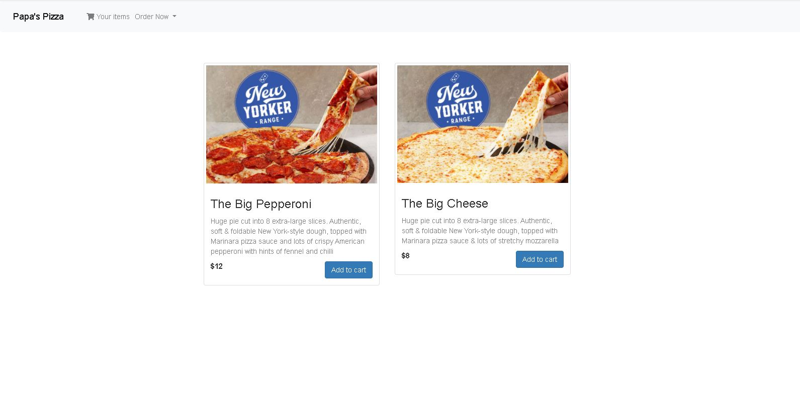

# OrderManager
Node JS sample pizza cart order manager with test payment API integration

Firstly to run the app, on the folder do a npm install, then an npm start to run the server, then go on localhost:3000

Make sure you have mongoDB installed, ideally you have the mongoDB compass community running too

For the sample payment application, I am using Stripe. To integrate for your own perusal make sure to add your own secret key in the routes/ index.js and publishable key in the javascript/ payment.js

The aim of the app is to implement a simple order and payment application as per per the requirement. I hope I've achieved this. 

If you have any question or issues running the app, or intent to build a more complex application kindly please let me know. 

I do hope I could join to be part of your team, Thank you very much

